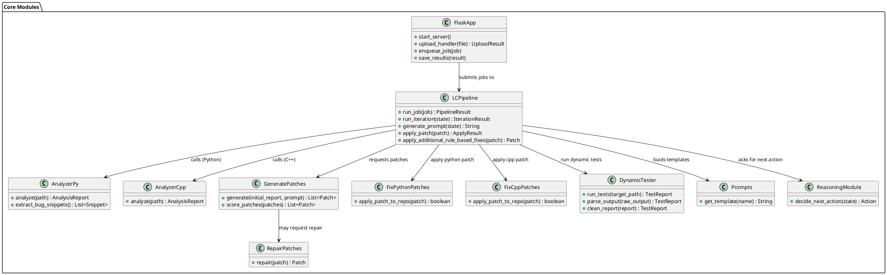
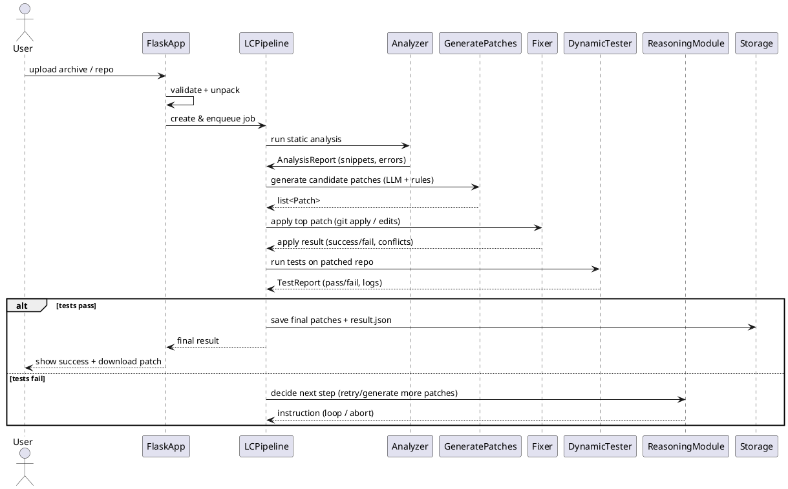

## UML — Detailed system overview (Mermaid)

This file documents the system flow from a user upload through analysis, patch generation, patch application, dynamic testing, and final output. It includes a class diagram with the key classes/modules and their important functions, and a sequence diagram showing the runtime flow. Use VS Code Markdown preview with Mermaid support or https://mermaid.live to render.

---

### Quick contract (what this doc conveys)
- Inputs: uploaded code / project files (via UI or API). Also test harness and repo working tree.
- Outputs: final patch set, applied-changes, dynamic test report (result.json / web UI), and logs.
- Success: pipeline produces patches and verification tests pass or produce clear failure reasons.
- Error modes: missing dependencies, test-time failures, patch application conflicts.

---

### How to view
- In VS Code: open this file and toggle Markdown preview. If Mermaid doesn't render, install "Markdown Preview Mermaid Support" or use `mermaid.live`.

---

### Mermaid class diagram (high level)

---

### Mermaid sequence diagram (upload → final output)

---

### Important functions and explanations (per module)

Note: function names are representative of the code in `agent/` and the pipeline. Where signatures vary slightly in the repo, treat these as the API contract.

- FlaskApp
  - start_server(): boots the Flask application and background worker (queues jobs).
  - upload_handler(file) -> UploadResult: validates the upload (archive or single file), returns a `job` object with paths and metadata.
  - enqueue_job(job): pushes the job to the pipeline or background queue.
  - save_results(result): writes `result.json` and returns path.

- LCPipeline (core orchestrator)
  - run_job(job) -> PipelineResult: top-level entry for processing an uploaded job. Orchestrates analyzer, patch generator, fixer and tester.
  - run_iteration(state) -> IterationResult: runs one iteration of LLM prompt -> generate patches -> apply -> test -> record outcome.
  - generate_prompt(state) -> str: builds the prompt for the LLM using `Prompts` templates and current `state` (previous patches, failing tests etc.).
  - apply_patch(patch) -> ApplyResult: uses patch application helpers (git apply, or patch files) and returns success/failure and conflict reasons.
  - apply_additional_rule_based_fixes(patch) -> Patch: deterministic post-processing to reduce false positives.

- AnalyzerPy / AnalyzerCpp
  - analyze(path) -> AnalysisReport: runs static checks (linters, AST scanning, custom heuristics) and returns candidate bug locations and snippets.
  - extract_bug_snippets() -> list[Snippet]: returns small repro/test snippets for LLM or patch verification.

- GeneratePatches
  - generate(initial_report, prompt) -> list[Patch]: calls the LLM with the prompt + context and returns candidate textual patches (diffs) and metadata (confidence, token usage).
  - score_patches(patches) -> list[Patch]: ranks patches heuristically (test pass rate, lint results, static checks).

- RepairPatches
  - repair(patch) -> patch: attempts to syntactically fix malformed patches (e.g., fix whitespace, context hunks), used when LLM output contains minor formatting issues.

- FixPythonPatches / FixCppPatches
  - apply_patch_to_repo(patch) -> bool: applies a patch to the working copy (may use `git apply --index` or direct file edits). Returns applied flag and stores revert info.
  - If conflict: record conflict and optionally attempt auto-resolution using `--theirs` or patterns.

- DynamicTester
  - run_tests(target_path) -> TestReport: runs unit tests, integration tests, or a custom test harness (can be OS-specific for C++/Qt). Returns pass/fail and raw logs.
  - parse_output(raw_output) -> TestReport: parse runner output and extract failing tests and traces.
  - clean_report(report) -> TestReport: remove noisy lines, standardize results for UI.

- ReasoningModule
  - decide_next_action(state) -> Action: given iteration history and test results, decide whether to accept patch, generate more patches, or abort.

- Prompts
  - get_template(name) -> str: returns prompt strings used to query the LLM (iteration prompt, fix prompt, repair prompt).

---

### Edge cases & developer notes
- Missing deps / venv differences: dynamic testing may fail on CI or local machine when dependencies are missing. To reduce noise ensure the test environment mirrors runtime (use `venv` or docker).
- Patch application conflicts: the pipeline should keep a patch application log and stash working tree before attempting an apply. On conflict, pipeline may auto-accept theirs or create a manual review record.
- LLM hallucinations: always run tests to verify patches; prefer small, incremental patches and deterministic rule-based post-fixers.
- Security: uploaded archives must be scanned and run tests in sandboxed environment when possible.

---

### Rendering tips
- For VS Code: install a Mermaid-enabled Markdown preview extension to see the diagrams inline.
- For quick sharing: copy the Mermaid blocks to https://mermaid.live and export PNG/SVG.

---

### File location
- `docs/uml_detailed.md` (this file)

---

If you want, I can also:
- generate a PNG/SVG of these diagrams and save it under `docs/` (helpful for READMEs), or
- produce a PlantUML variant if your team prefers PlantUML, or
- extract a more detailed per-function call graph from the code automatically (that requires a repository scan).

Tell me which follow-up you prefer and I'll proceed.
